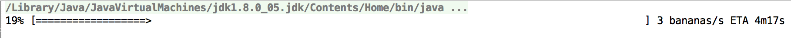

# ETAPrinter

Java library that gives you the ETA and displays a progress bar when you process a batch of data.



The available metrics are:

* The progression percentage (the numeric value and a cool progress bar)
* The processing speed
* The ETA: when will the process be finished?

## Installation

Clone this github repository, launch `mvn clean install` and add the following maven dependency to your project:

```
<dependency>
  <groupId>com.vdurmont</groupId>
  <artifactId>etaprinter</artifactId>
  <version>1.0.0</version>
</dependency>
```

## Example

You can find a working example in the [examples directory](./examples).

## Basic usage

```
Source source = // Your source of elements (your DAO for example)

// The total number of elements you will process
long total = source.size();

// Init the printer
ETAPrinter printer = ETAPrinter.init(total);

while(source.hasNext()) {
  List<Element> elements = source.getNextBatch(); // Get the next batch of elements to process

  process(elements); // That is your business logic and it may take some time

  // We update the ETA by giving the number of elements that were processed since the last update
  printer.update(elements.size());
}
```

## Advanced usage

There are a few options that you can choose when you initialize the printer:

* `ETAPrinter.init(long total)`
* `ETAPrinter.init(String elementName, long total)`
* `ETAPrinter.init(long total, OutputStream stream, boolean closeStream)`
* `ETAPrinter.init(String elementName, long total, OutputStream stream, boolean closeStream)`

Parameters:

* `total`: total number of elements that are going to be processed  
* `elementName`: the name of the element  
If this parameter is given, the speed will be printed with the following format: `42 [elementName]/s`. Else, it will be `42/s`.
* `stream`: the OutputStream where the ETA is printed  
Default value is `System.out`.
* `closeStream`: if true, the stream will be closed when the process will end (the number of processed elements will be greater or equal to the total number of elements). Default is `false`.
